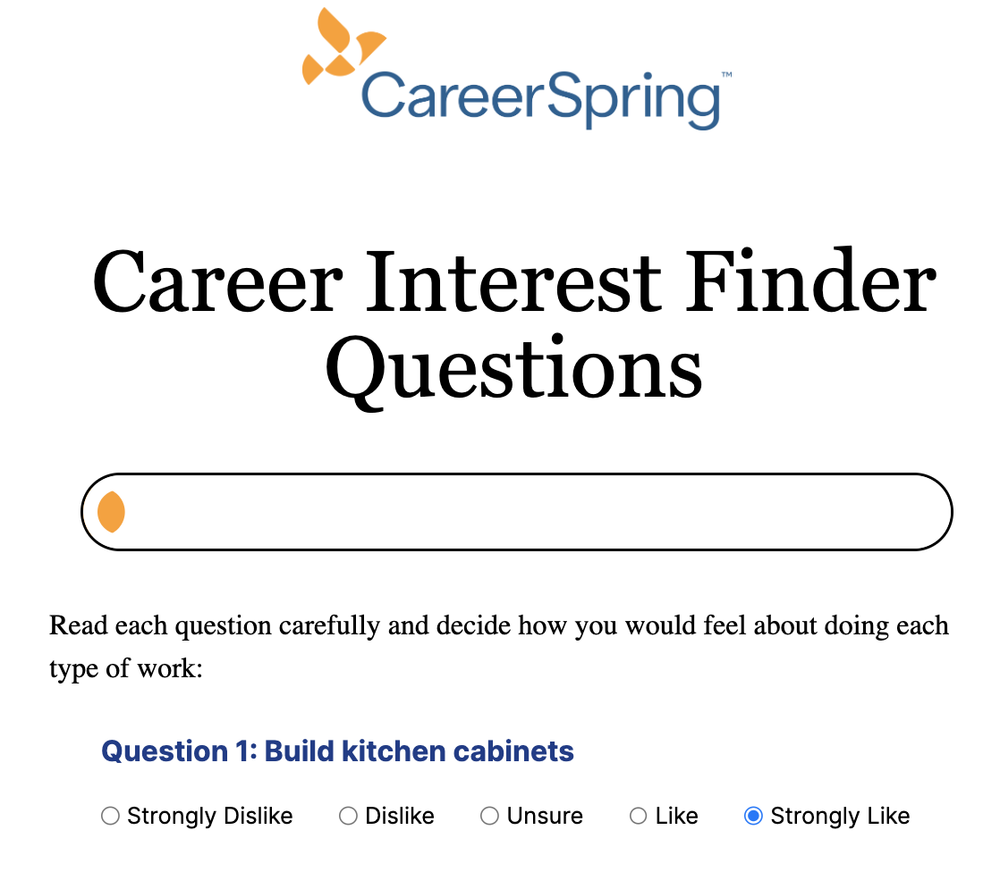

# About #
This is a webpage for CareerSpring, an online networking and job placement platform that helps first generation and/or low-income (FGLI) college students acquire high-quality employment and launch meaningful careers. They provide tools and resources for these students, including an assessment to highlight and recommend career paths.

Currently, this interest finder assessment is hosted and integrated with *Wordpress*. To provide a better experience for students, the interest finder assessment should be built on a new website.

We are tasked to develop the front end experience for users according to the existing design, integrate the ONET, deploy the website, and provide training and documentation for the staff.

This project is a ReactJS application that fetches job recommendations from the ONET api, interacts with Google Sheets using a private key and client email, and sends data to users using the EmailJS API. The project also uses Tailwind CSS for styling.

This is a [Next.js](https://nextjs.org/) project bootstrapped with [`create-next-app`](https://github.com/vercel/next.js/tree/canary/packages/create-next-app).

## Prerequisites
Node.js and npm version "20.12.7" or later installed
**Installation of Node Modules**
```bash
run npm install npm@latest -g
```

Basic knowledge of ReactJS and JavaScript

## Getting Started
First clone the project into your local environment, and cd into the file.
```bash
git clone https://github.com/ymahallaty/CareerSpring-Interest-Finder.git
```

Then, install the dependencies:

```bash
npm install
```

Then, run the development server:

```bash
npm run dev
# or
yarn dev
# or
pnpm dev
# or
bun dev
```

Open [http://localhost:3000](http://localhost:3000) with your browser to see the result.

You can start editing the page by modifying `app/page.js`. The page auto-updates as you edit the file.

This project uses [`next/font`](https://nextjs.org/docs/basic-features/font-optimization) to automatically optimize and load Inter, a custom Google Font.

## Environment Variables
Create a .env file in the *root* of your project and add the following:

- LOGIN_NAME=[]
- PASSWORD=[]
- NEXT_PUBLIC_EMAIL_TEMPLATE_ID=<YOUR_EMAILJS_TEMPLATE_ID>
- NEXT_PUBLIC_EMAIL_SERVICE_ID=<YOUR_EMAILJS_SERVICE_ID>
- GOOGLE_CLIENT_EMAIL="<YOUR_GOOGLE_SHEET_CLIENT_EMAIL>"
- GOOGLE_PRIVATE_KEY="<YOUR_GOOGLE_SHEET_PRIVATE_KEY>"

## Usage and Features




- The progess bar allows users to keep track of their place in the assessment and updates with every answer.
- Answers are stored and displayed in the url, allowing users to refresh the page and navigate the assessment without losing their progress.
- Students who already took the assessment can enter their scores on the enter scores page and get personalized results

## More Information on APIs Used
"ONET Web Services uses a RESTful external site web services API. Currently all resources are read-only and accessed with the GET method. Access is limited to registered developers; you can obtain access credentials and instructions by signing up for the developer program. Before you sign up, you can try our interactive demo to see the API in action. The services currently use the O*NET 28.3 Database." [(ONET Reference Manual)](https://services.onetcenter.org/reference/)
* Onet Api [https://services.onetcenter.org/reference/mnm/ip/ip_questions](ONET Api Link for the Assessment Questions) *

* Onet Api [https://services.onetcenter.org/reference/mnm/ip/ip_careers](ONET Api Link for the Personalized Job Recommendations) *
## Additional Notes

Ensure that you do not commit the .env file to version control.
Refer to the respective API documentation for further customization and advanced usage.

## References
[https://www.emailjs.com/docs/](EmailJS Documentation)
[https://nextjs.org/docs](NextJS Documentation)

## Learn More

To learn more about Next.js, take a look at the following resources:

- [Next.js Documentation](https://nextjs.org/docs) - learn about Next.js features and API.
- [Learn Next.js](https://nextjs.org/learn) - an interactive Next.js tutorial.

You can check out [the Next.js GitHub repository](https://github.com/vercel/next.js/) - your feedback and contributions are welcome!

## Other Technologies used

DaisyUI
TailwindPlayground
Tailwind
MaterialUI

## Deploy on Vercel

The easiest way to deploy your Next.js app is to use the [Vercel Platform](https://vercel.com/new?utm_medium=default-template&filter=next.js&utm_source=create-next-app&utm_campaign=create-next-app-readme) from the creators of Next.js.
## Our Deployment 
https://career-spring-interest-finder.vercel.app/ 
Check out our [Next.js deployment documentation](https://nextjs.org/docs/deployment) for more details.

# Contributors
@davonbl - Backend Lead @g-saint97 - Team Lead @dayofthetech @liangbelinda @marciaharris - Frontend Lead